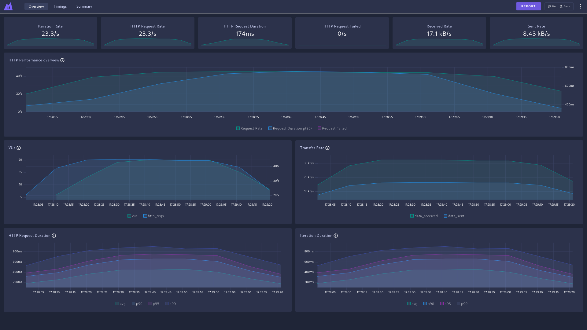
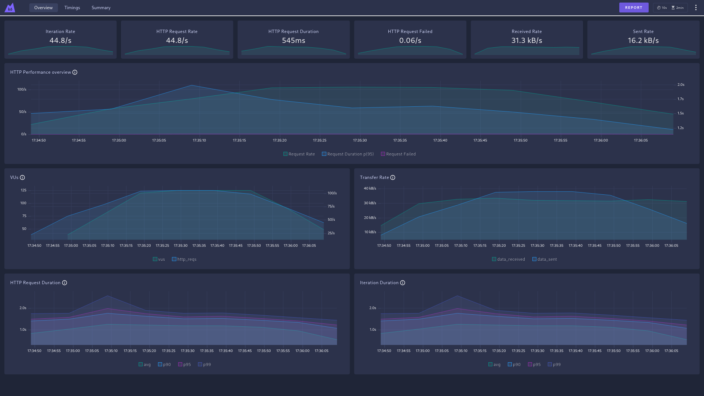
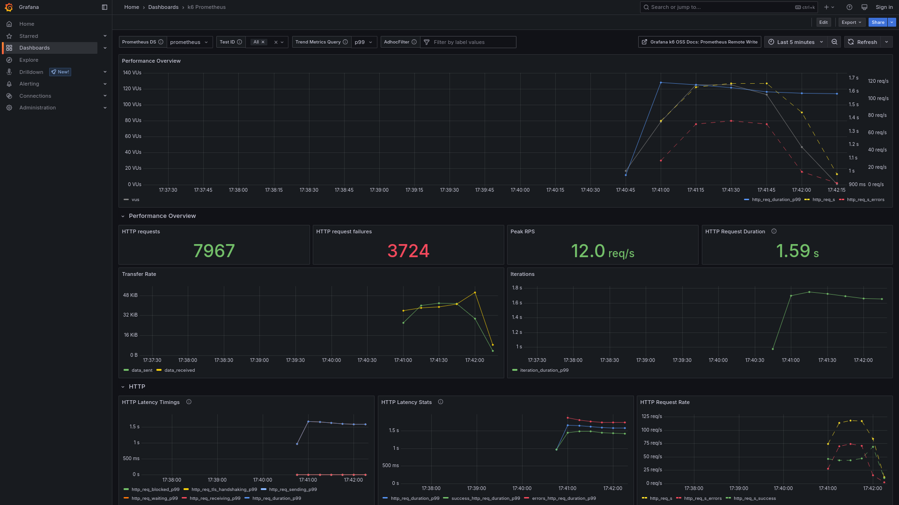

### a)
```
data_received..................: 651 kB 33 kB/s
data_sent......................: 327 kB 16 kB/s
http_req_blocked...............: avg=13.4µs   min=4.81µs  med=7.12µs   max=585.62µs p(90)=8.66µs   p(95)=9.63µs  
http_req_connecting............: avg=3.4µs    min=0s      med=0s       max=393.83µs p(90)=0s       p(95)=0s      
http_req_duration..............: avg=337.11ms min=22.74ms med=311.03ms max=1.13s    p(90)=568.43ms p(95)=662.72ms
  { expected_response:true }...: avg=337.11ms min=22.74ms med=311.03ms max=1.13s    p(90)=568.43ms p(95)=662.72ms
http_req_failed................: 0.00%  0 out of 903
http_req_receiving.............: avg=59.81µs  min=34.92µs med=57.68µs  max=169.85µs p(90)=76.67µs  p(95)=84.88µs 
http_req_sending...............: avg=23.65µs  min=12.36µs med=21.3µs   max=325.6µs  p(90)=28.38µs  p(95)=37.61µs 
http_req_tls_handshaking.......: avg=0s       min=0s      med=0s       max=0s       p(90)=0s       p(95)=0s      
http_req_waiting...............: avg=337.02ms min=22.66ms med=310.96ms max=1.13s    p(90)=568.35ms p(95)=662.65ms
http_reqs......................: 903    45.08695/s
iteration_duration.............: avg=337.24ms min=22.86ms med=311.16ms max=1.13s    p(90)=568.54ms p(95)=662.82ms
iterations.....................: 903    45.08695/s
vus............................: 1      min=1        max=20
vus_max........................: 20     min=20       max=20
```

The api call took on average 337.02ms, with a minimum time of 22.86ms and a maximum time of 1.13s. It made 903 requests, and none failed.

### b)
```
data_received..................: 2.1 MB 23 kB/s
data_sent......................: 1.1 MB 12 kB/s
http_req_blocked...............: avg=9.21µs   min=4.67µs  med=7.12µs   max=458.23µs p(90)=8.66µs   p(95)=9.56µs  
http_req_connecting............: avg=1.16µs   min=0s      med=0s       max=317.7µs  p(90)=0s       p(95)=0s      
http_req_duration..............: avg=418.9ms  min=27.09ms med=395.12ms max=1.45s    p(90)=693.33ms p(95)=806.62ms
  { expected_response:true }...: avg=417.05ms min=27.09ms med=394.42ms max=1.39s    p(90)=686.66ms p(95)=801.8ms 
http_req_failed................: 0.20%  6 out of 2908
http_req_receiving.............: avg=63.76µs  min=32.4µs  med=60.06µs  max=346.62µs p(90)=82.85µs  p(95)=92.74µs 
http_req_sending...............: avg=23.05µs  min=11.31µs med=21.58µs  max=233.62µs p(90)=29.05µs  p(95)=33.8µs  
http_req_tls_handshaking.......: avg=0s       min=0s      med=0s       max=0s       p(90)=0s       p(95)=0s      
http_req_waiting...............: avg=418.81ms min=27.01ms med=395.02ms max=1.45s    p(90)=693.24ms p(95)=806.53ms
http_reqs......................: 2908   32.185421/s
iteration_duration.............: avg=419.03ms min=27.2ms  med=395.22ms max=1.45s    p(90)=693.45ms p(95)=806.77ms
iterations.....................: 2908   32.185421/s
vus............................: 1      min=1         max=20
vus_max........................: 20     min=20        max=20
```

### c)
```
     data_received..................: 3.1 MB 35 kB/s
     data_sent......................: 1.6 MB 17 kB/s
     http_req_blocked...............: avg=8.32µs   min=4.67µs  med=6.7µs    max=433.01µs p(90)=8.17µs   p(95)=8.66µs  
     http_req_connecting............: avg=750ns    min=0s      med=0s       max=303.81µs p(90)=0s       p(95)=0s      
   ✓ http_req_duration..............: avg=280.98ms min=18.88ms med=264.06ms max=946.85ms p(90)=459.09ms p(95)=540.75ms
       { expected_response:true }...: avg=280.98ms min=18.88ms med=264.06ms max=946.85ms p(90)=459.09ms p(95)=540.75ms
   ✓ http_req_failed................: 0.00%  0 out of 4334
     http_req_receiving.............: avg=55.92µs  min=27.23µs med=53.35µs  max=154.07µs p(90)=72µs     p(95)=80.15µs 
     http_req_sending...............: avg=20.96µs  min=10.05µs med=19.83µs  max=293.61µs p(90)=25.7µs   p(95)=29.54µs 
     http_req_tls_handshaking.......: avg=0s       min=0s      med=0s       max=0s       p(90)=0s       p(95)=0s      
     http_req_waiting...............: avg=280.9ms  min=18.73ms med=263.94ms max=946.79ms p(90)=459.03ms p(95)=540.68ms
     http_reqs......................: 4334   48.14623/s
     iteration_duration.............: avg=281.09ms min=19.32ms med=264.17ms max=946.94ms p(90)=459.2ms  p(95)=540.85ms
     iterations.....................: 4334   48.14623/s
     vus............................: 1      min=1         max=20
     vus_max........................: 20     min=20        max=20
```

The SLOs were met.

### d)
```
     ✓ is status 200
     ✓ body size is less than 1,000 bytes

   ✓ checks.........................: 100.00% 7430 out of 7430
     data_received..................: 2.7 MB  30 kB/s
     data_sent......................: 1.3 MB  15 kB/s
     http_req_blocked...............: avg=8.65µs   min=4.74µs  med=7.12µs   max=493.57µs p(90)=8.52µs   p(95)=9.08µs  
     http_req_connecting............: avg=765ns    min=0s      med=0s       max=214.48µs p(90)=0s       p(95)=0s      
   ✓ http_req_duration..............: avg=327.62ms min=21.33ms med=306.01ms max=1.13s    p(90)=544.66ms p(95)=626.29ms
       { expected_response:true }...: avg=327.62ms min=21.33ms med=306.01ms max=1.13s    p(90)=544.66ms p(95)=626.29ms
   ✓ http_req_failed................: 0.00%   0 out of 3715
     http_req_receiving.............: avg=64.14µs  min=35.75µs med=61.53µs  max=282.29µs p(90)=80.52µs  p(95)=89.41µs 
     http_req_sending...............: avg=24.2µs   min=10.75µs med=22.62µs  max=434.55µs p(90)=29.05µs  p(95)=33.38µs 
     http_req_tls_handshaking.......: avg=0s       min=0s      med=0s       max=0s       p(90)=0s       p(95)=0s      
     http_req_waiting...............: avg=327.53ms min=21.21ms med=305.9ms  max=1.13s    p(90)=544.58ms p(95)=626.21ms
     http_reqs......................: 3715    41.265887/s
     iteration_duration.............: avg=327.79ms min=21.47ms med=306.15ms max=1.13s    p(90)=544.82ms p(95)=626.46ms
     iterations.....................: 3715    41.265887/s
     vus............................: 1       min=1            max=20
     vus_max........................: 20      min=20           max=20
```

### e)


### f)
```
     ✗ is status 200
      ↳  45% — ✓ 3165 / ✗ 3723
     ✓ body size is less than 1,000 bytes

   ✗ checks.........................: 72.97% 10053 out of 13776
     data_received..................: 2.7 MB 30 kB/s
     data_sent......................: 2.5 MB 28 kB/s
     http_req_blocked...............: avg=17.35µs  min=4.26µs  med=6.7µs    max=20.84ms  p(90)=11.24µs p(95)=13.87µs
     http_req_connecting............: avg=8.09µs   min=0s      med=0s       max=20.74ms  p(90)=0s      p(95)=0s     
   ✗ http_req_duration..............: avg=1.09s    min=38.66ms med=1.21s    max=3.06s    p(90)=1.52s   p(95)=1.63s  
       { expected_response:true }...: avg=777.98ms min=38.66ms med=755.17ms max=2.51s    p(90)=1.25s   p(95)=1.39s  
   ✗ http_req_failed................: 54.05% 3723 out of 6888
     http_req_receiving.............: avg=54.6µs   min=20.6µs  med=50.42µs  max=1.45ms   p(90)=76.89µs p(95)=90.37µs
     http_req_sending...............: avg=23.28µs  min=10.05µs med=20.53µs  max=307.02µs p(90)=31.91µs p(95)=38.52µs
     http_req_tls_handshaking.......: avg=0s       min=0s      med=0s       max=0s       p(90)=0s      p(95)=0s     
     http_req_waiting...............: avg=1.09s    min=38.59ms med=1.21s    max=3.06s    p(90)=1.52s   p(95)=1.63s  
     http_reqs......................: 6888   76.362516/s
     iteration_duration.............: avg=1.09s    min=38.82ms med=1.21s    max=3.06s    p(90)=1.52s   p(95)=1.63s  
     iterations.....................: 6888   76.362516/s
     vus............................: 1      min=1              max=125
     vus_max........................: 125    min=125            max=125
```


The thresholds were crossed and now there's a positive HTTP request failed rate, confirming the failed HTTP requests.

### g)


Both of the thresholds were crossed, and the check "is status 200" only succeed with a rate of 53%.