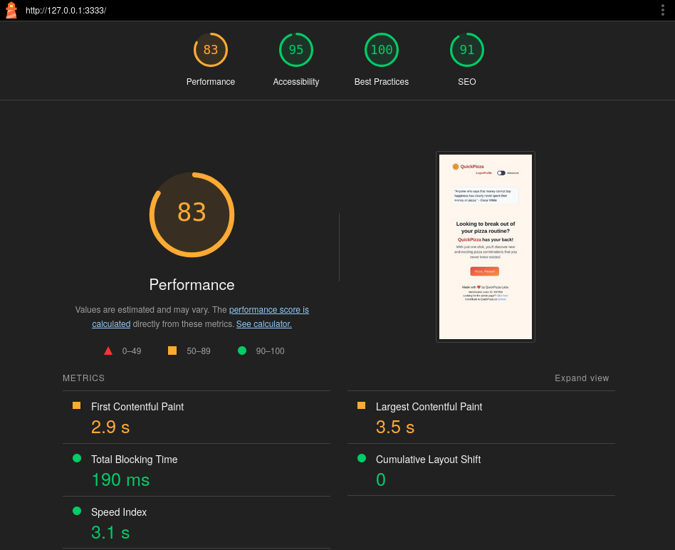
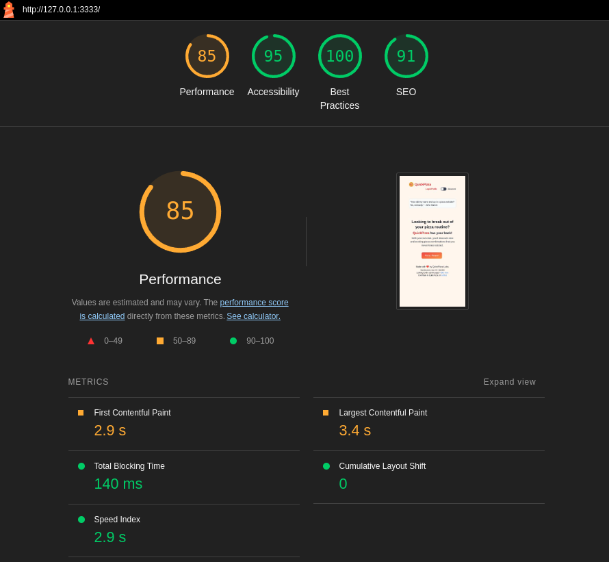
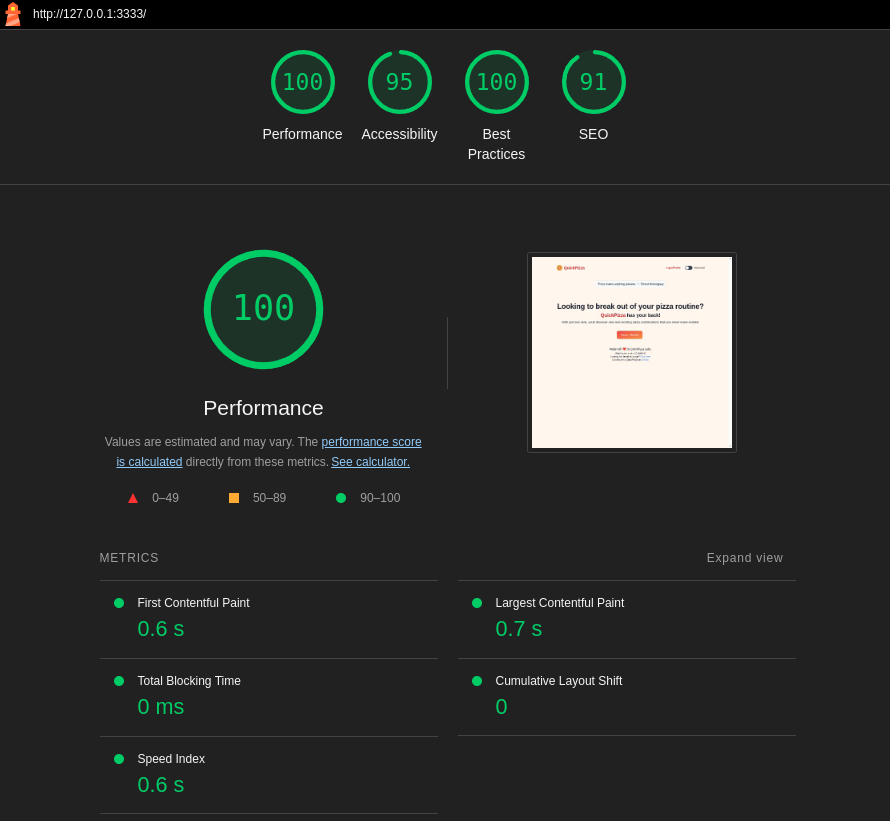
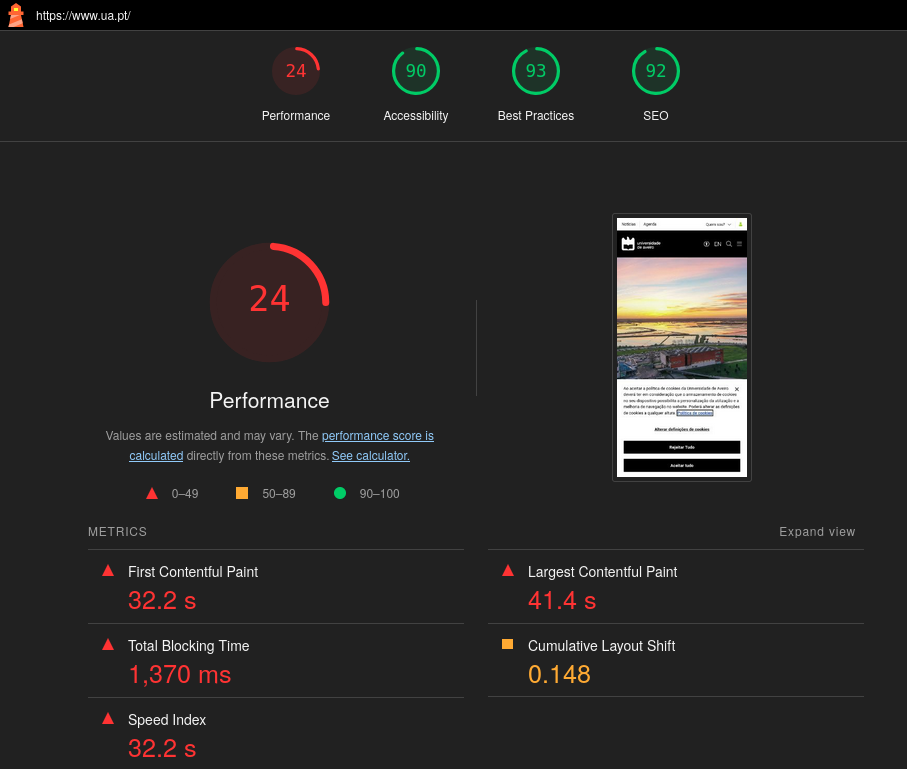

### c)
- For the frontend performance, the report uses "KiB" which means kibibyte and it is a measure of computer storage/information, and "ms" which represents milliseconds and it is a measure of time. For both, the least the better (where possible).
- To make the site more accessible, according to the lighthouse report, I would improve the legibility of the content by elevating the contrast ratio between the background and the foreground colors. There are also some manual checks that I would perform to guarantee its accessibility.

### d)

The results are the same as before, for the normal tab and the incognito tab. Using an incognito tab might be a better approach because the local computer scores may be affected by plugins/extensions installed and used in the normal tab.

### e)

The results are clearly better, returning an excellent score for the performance metric. The tests done on both differ slightly. On mobile, the performance score takes into account similar metrics, but also considers factors specific to mobile devices, such as mobile-friendly design, responsive layout and the impact of slower mobile networks. Mobile devices also tend to have less processing power, smaller screens and slower network connections compared to desktops.

### f)
These non-functional tests are worth doing because, at first, they are very cheap and can reduce costs by identifying problems early in the development process. They help to ensure a software application is stable, reliable and secure. Despite that, these tests may also improve the user experience and can boost a brand's reputation.

### g)
I performed the lighthouse test on the mobile version of https://www.ua.pt.

The performance is the only metric that is way below the line. The main problem is the time it takes to load the content. Fixing issues like these in a site that has been live for such a long time may be hard because things might be too coupled to be changed with ease. Given all the content that is presented when someone opens the website, maybe this couldn't be avoided, although there are some topics on the diagnostics that could be changed, like: "Minimize main-thread work", "Reduce unused CSS" and "Reduce unused JavaScript".
