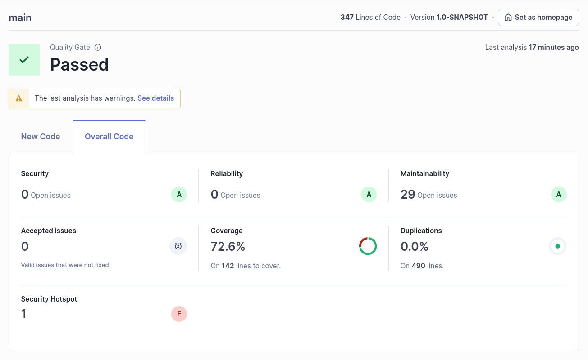

### f)

The analysis state that 72.6% of the code was covered, and there are no open issues for security nor reliability, and there are 29 open issues on maintainability.
No code was duplicated, and there's a security hotspot, regarding the usage of a pseudorandom number generator, which may not be safe enough for the project.

### g)

| Issue            | Problem description                                                                                                               | How to solve                                                                                                                                                                                                                                                                                                             |
|------------------|-----------------------------------------------------------------------------------------------------------------------------------|--------------------------------------------------------------------------------------------------------------------------------------------------------------------------------------------------------------------------------------------------------------------------------------------------------------------------|
| Security         | N/A                                                                                                                               | N/A                                                                                                                                                                                                                                                                                                                      |
| Reliability      | N/A                                                                                                                               | N/A                                                                                                                                                                                                                                                                                                                      |
| Maintainability  | Invoke method(s) only conditionally. Refactor the code in order to not assign to this loop counter from within the loop body. | Both of the issues are graded as Medium severity. To solve the first one, I should execute the method format() outside the log.info() arguments, as this can result in a performance penalty. As for the second error, the counter shouldn't be changed during the loop execution, so moving it would solve the problem. |
| Security Hotspot | Make sure that using this pseudorandom number generator is safe here.                                                             | Since this project isn't being used for any serious matter, I can ignore. However, to fix the problem, according to OWASP ASVS, I should change it to a cryptographically secure function, such as java.security.SecureRandom.                                                                                           |

### h)

Checkstyle is a development tool that helps programmers write Java that adheres to a coding standard. This is useful for projects that want to enforce such a thing.

PMD is an extensible multilanguage static code analyzer. It finds common programming flaws like unused variables, empty catch blocks, unnecessary object creation and so forth. It is mainly concerned with Java and Apex, and it comes with 400+ built-in rules, though it can be extended with custom ones.

SpotBugs is a static analysis tool that looks for bugs in Java code. It checks for more than 400 bug patterns, which include the categories: "Bad practice", "Correctness", "Security", "Bogus random noise", and more.
