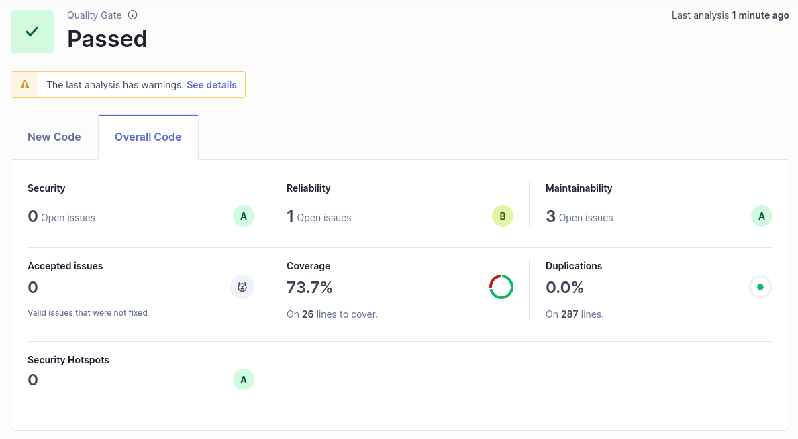

### b)

### c)

The chart does not show any data, which means that the issues shouldn't introduce implied cost of additional work in the future.

### d)

The analysis didn't cover 26 lines, and it found 4 issues: 3 under the maintainability tab, with high and low severity, and 1 under reliability, with a low severity. Overall, the values are ok, and I can easily improve my project.

### e)

The issues are now fixed, and the dashboard presents no issues on the analysis.

### f)

The quality gate is failing because the code coverage is of 71.8% which is less than 80%. The other factors are passing (0 issues, security hotspots reviewed and less than 3.0% duplicated code)

### g)

I created a quality gate that passes when the code coverage is less than 70% to accommodate to my analysis. With this change, this quality gate passes.

### h)

The new code passes the created quality gate.